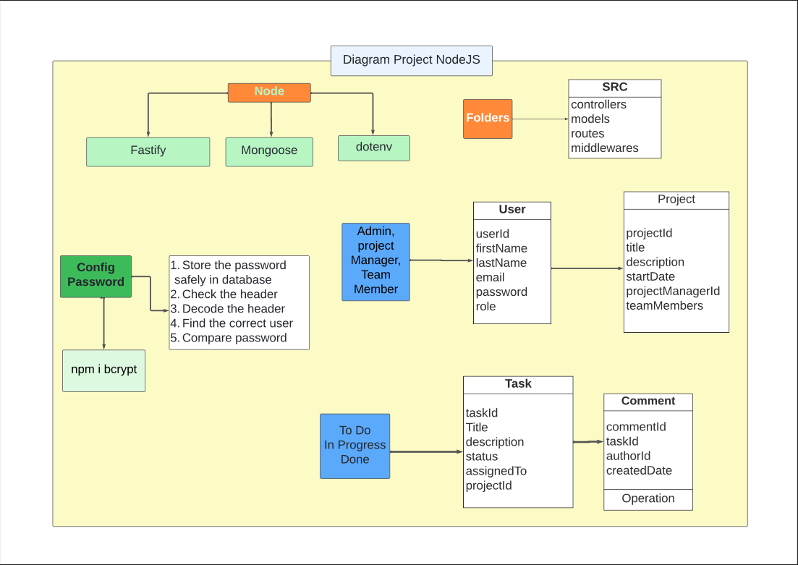

# Project Name: Buildin-an-API

## Description:

The project consists of an API for project control. A CRUD of users and projects. The database was hosted on MongoDB, on the Free Plan. You can use Postman to do the tests on your local machine - localhost://5000 or another port of your choice.

### Add dependencies:

-   installs NVM (Node Version Manager)

`curl -o- https://raw.githubusercontent.com/nvm-sh/nvm/v0.39.7/install.sh | bash`

-   download and install Node.js

`nvm install 20`

-   verifies the right Node.js version is in the environment

`node -v` # should print `v20.12.2`

-   verifies the right NPM version is in the environment

`npm -v` # should print `10.5.0`

#

-   Install Fastify
    ` npm install fastify`

-   Install Mongoose
    `npm install mongoose --save`

-   DotEnv
    `npm install dotenv --save`

-   node.bcrypt.js
    `npm install bcrypt`

#

### Project architecture:

#

### To run the api

`npm run dev`

### Links:

[Project in GitHub](https://github.com/cabraldasilvac/Buildin-an-API) 
[MongoDB](https://www.mongodb.com/) 
[Mongoose](https://mongoosejs.com/) 
[Fastify](https://fastify.dev/) 
[Bcrypt](https://www.npmjs.com/package/bcrypt) 
[Lucid-App](https://lucid.app/) 
[Postman](https://www.postman.com/)

### fonte: [dolearning](https://www.youtube.com/watch?v=ACVBMrgdXgE)
